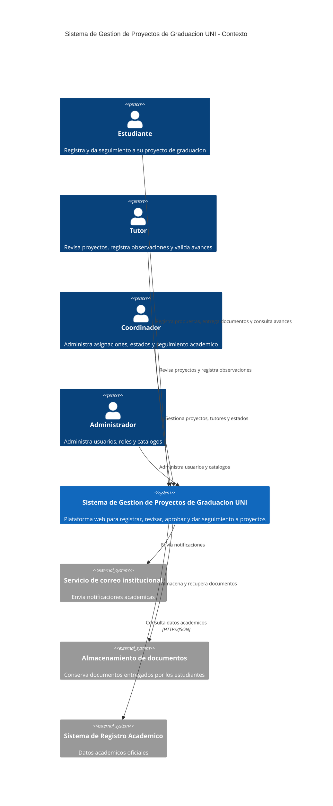
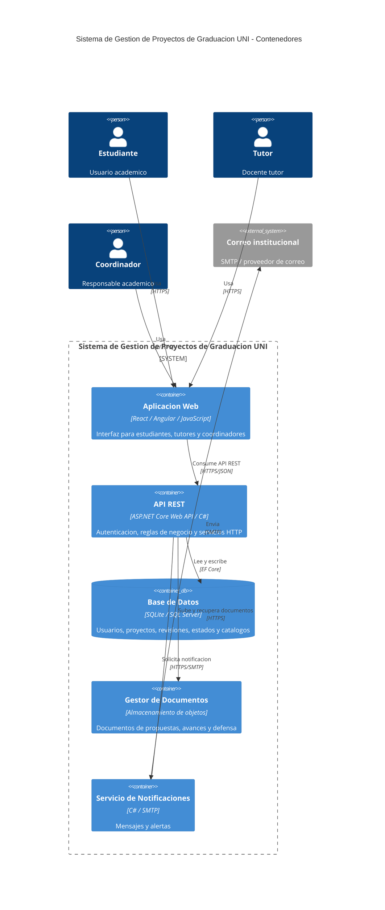
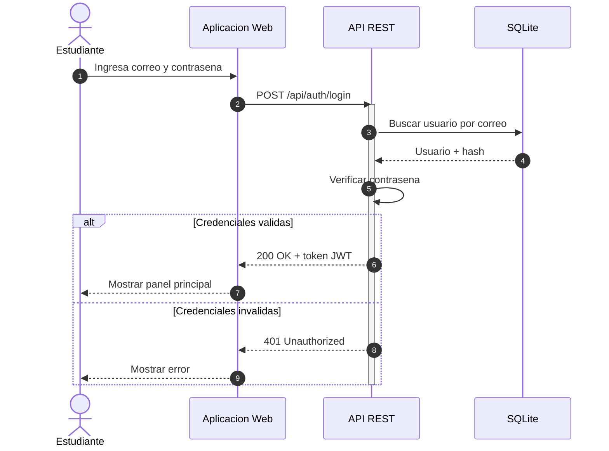
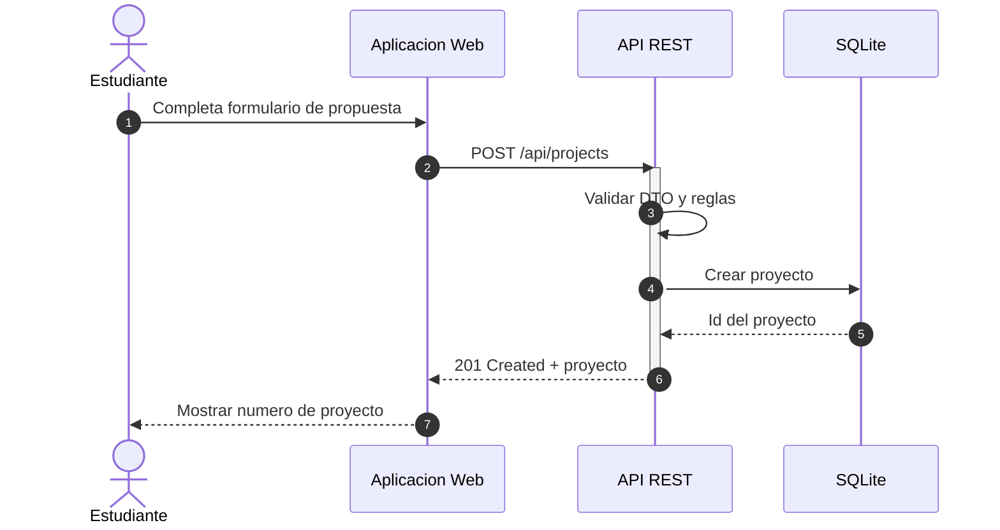
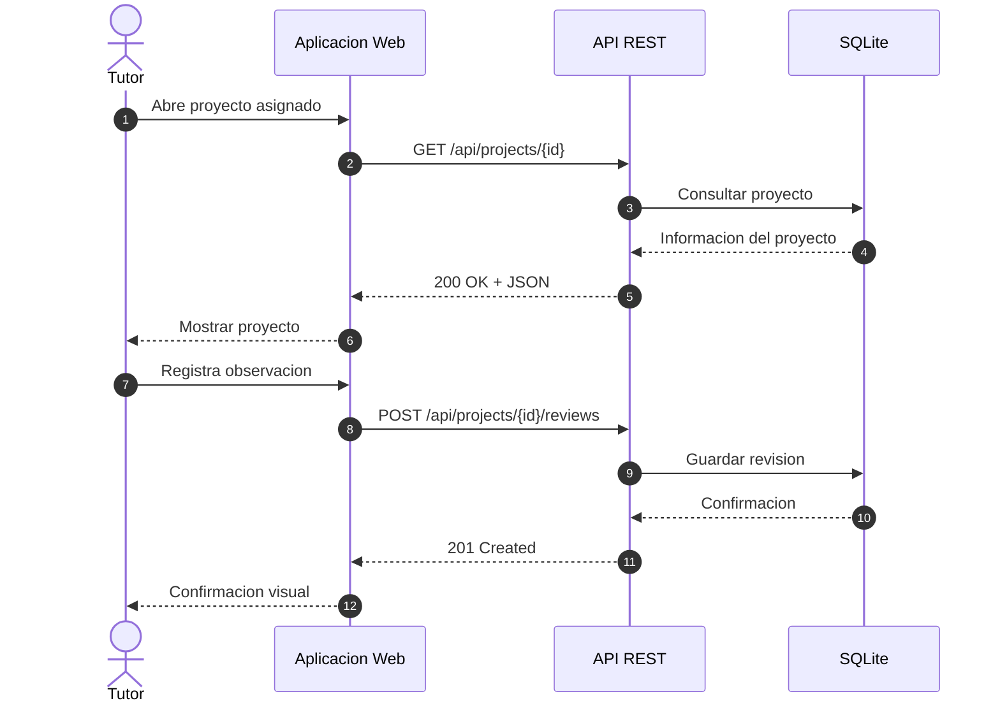
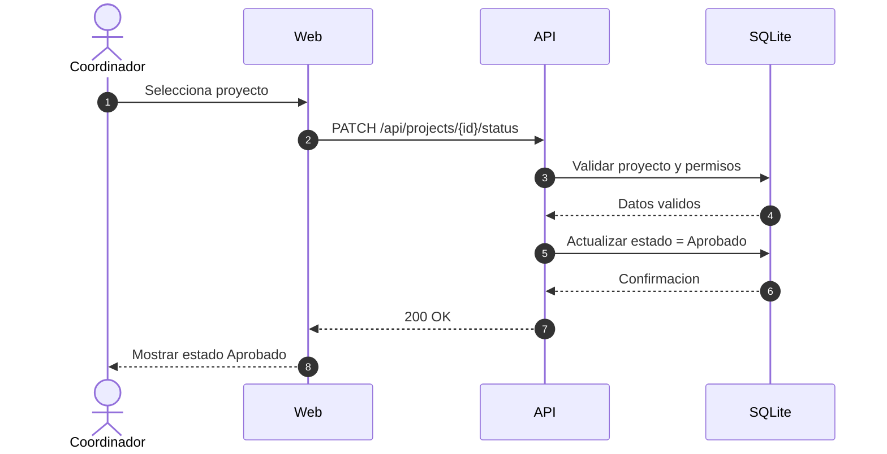

# Sistema de Gestión de Proyectos de Graduación UNI

Sistema web **API-First** para la gestión de proyectos de graduación en la Universidad Nacional de Ingeniería (UNI). Permite registrar propuestas, asignar tutores, dar seguimiento, registrar revisiones y controlar estados.

## Asignatura

**Diseño de Sistemas en Internet** — Programa Ingeniería de Sistemas — UNI

## Arquitectura

El proyecto utiliza **Modelo C4** (niveles 1 y 2) + **diagramas de secuencia** + **API-First**, documentado con **Mermaid.js** y versionado en GitHub.

### C4 Nivel 1 — Contexto



### C4 Nivel 2 — Contenedores



### Secuencia — Login



### Secuencia — Registrar propuesta



### Secuencia — Revisión del tutor



### Secuencia — Aprobar proyecto



## API principal

| Método | Endpoint | Descripción | Auth |
|---|---|---|---|
| POST | /api/auth/register | Registrar usuario | No |
| POST | /api/auth/login | Autenticar usuario | No |
| GET | /api/projects/mine | Listar proyectos del estudiante | Si |
| POST | /api/projects | Registrar propuesta | Si |
| GET | /api/projects/{id} | Consultar proyecto | Si |
| PATCH | /api/projects/{id}/status | Cambiar estado del proyecto | Si (Tutor/Coord/Admin) |
| POST | /api/projects/{id}/reviews | Registrar revisión | Si (Tutor/Coord/Admin) |
| GET | /api/projects/{id}/reviews | Listar revisiones | Si |

### Ejemplo de login

**Request:**

```
POST /api/auth/login
Content-Type: application/json

{
  "email": "estudiante2@uni.edu.ni",
  "password": "Test1234!"
}
```

**Response (200 OK):**

```json
{
  "userId": 2,
  "email": "estudiante2@uni.edu.ni",
  "role": "Estudiante",
  "token": "eyJhbGciOiJIUzI1NiIsInR5cCI6IkpXVCJ9..."
}
```

## Tecnologías

| Capa | Tecnología |
|---|---|
| Backend | ASP.NET Core Web API / C# 12 |
| ORM | Entity Framework Core 8 |
| Base de datos | SQLite (desarrollo) / SQL Server (producción) |
| Autenticación | JWT + Identity PasswordHasher |
| Documentación | Swagger / OpenAPI 3.0 |
| Diagramas | Mermaid.js (C4 + Secuencia) |
| Control de versiones | Git + GitHub |

## Ejecución local

### Requisitos

- .NET SDK 8.0
- Git
- Navegador moderno

### Pasos

```
# 1. Clonar el repositorio
git clone https://github.com/VioletGutierrez/GraduacionUni-2026.git
cd GraduacionUni-2026

# 2. Restaurar paquetes
cd src/GraduacionUni.Api
dotnet restore

# 3. Ejecutar la API
dotnet run
```

La API estará disponible en `http://localhost:5XXX` y Swagger en:

```
http://localhost:5XXX/swagger
```

La base de datos SQLite (`graduacionuni.db`) se crea automáticamente al arrancar.

### Probar la API

1. Abrir Swagger: `http://localhost:5XXX/swagger`
2. Registrar usuario: `POST /api/auth/register`
3. Copiar el `token` de la respuesta
4. Clic en **Authorize** → pegar token → **Authorize**
5. Probar endpoints protegidos

## Estructura del proyecto

```
GraduacionUni/
├── db/
│   ├── init.sql                  # Script SQL Server
│   └── init-sqlite.sql           # Script SQLite
├── docs/                          # Diagramas Mermaid
│   ├── c4-nivel1.mmd
│   ├── c4-nivel2.mmd
│   ├── secuencia-login.mmd
│   ├── secuencia-propuesta.mmd
│   ├── secuencia-revision.mmd
│   └── secuencia-aprobar.mmd
├── informe/                       # Informe de investigación
│   ├── informe-investigacion.md
│   ├── guion-defensa.md
│   └── capturas/
├── src/
│   └── GraduacionUni.Api/
│       ├── Domain/Entities/       # User.cs, Project.cs, Review.cs
│       ├── Application/
│       │   ├── DTOs/              # LoginRequest, RegisterRequest, ReviewRequest
│       │   └── Services/          # AuthService, TokenService
│       ├── Infrastructure/
│       │   └── Persistence/       # AppDbContext
│       ├── Controllers/           # AuthController, ProjectsController, ReviewsController
│       ├── Program.cs
│       ├── appsettings.json
│       └── GraduacionUni.Api.csproj
├── requests.http                  # Pruebas manuales de API
├── .gitignore
└── README.md
```

## Seguridad

- Contraseñas hasheadas con `IPasswordHasher<User>` (nunca en texto plano)
- Autenticación JWT con expiración de 8 horas
- Uso de DTOs para no exponer entidades
- `AsNoTracking()` en consultas de solo lectura
- Validación de entrada en controladores
- **Producción**: usar `dotnet user-secrets` para claves JWT y cadenas de conexión

## Decisiones arquitectónicas

| Decisión | Justificación |
|---|---|
| **Modelo C4** | Comunica arquitectura a audiencias técnicas y no técnicas sin sobrecarga UML |
| **API-First** | El contrato HTTP se diseña antes que la UI, permitiendo desarrollo paralelo frontend/backend |
| **SQLite en dev** | Cero configuración, sin instalación pesada, ideal para desarrollo y pruebas |
| **EF Core + DTOs** | Separa dominio de persistencia y expone solo lo necesario |
| **JWT** | Estándar para APIs REST stateless, escalable horizontalmente |
| **Mermaid en README** | Diagramas versionados como código, revisables en PRs |
| **Inyección de dependencias** | Facilita testing, desacopla implementaciones |
| **PasswordHasher de Identity** | Algoritmo PBKDF2 seguro, evita reinventar ruedas |

## Referencias

- [C4 Model](https://c4model.com/)
- [Mermaid Sequence Diagrams](https://mermaid.js.org/syntax/sequenceDiagram.html)
- [ASP.NET Core Web API](https://learn.microsoft.com/aspnet/core/web-api/)
- [Entity Framework Core](https://learn.microsoft.com/ef/core/)
- [JWT.io](https://jwt.io/)

## Autores

- Violet Gutierrez — Universidad Nacional de Ingeniería

## Licencia

Proyecto académico — UNI 2026
